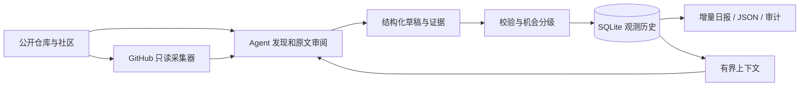

# Open Source Radar

**把开源项目发现，变成有证据、可追踪、可恢复的贡献机会工作流。**

[](https://github.com/s1encisi/open-source-radar/actions/workflows/ci.yml)


[](LICENSE)

Open Source Radar 是一个 Python 标准库实现的本地数据工具与 Codex Skill。它把项目资料、issue 核验和个人能力证据组织成结构化记录，生成中文日报，并用 SQLite 保存跨会话的观测历史。

**Evidence-backed open-source discovery and contribution triage, with local SQLite memory and recoverable reports.**

[快速演示](#一分钟运行离线演示) · [示例日报](examples/sample-report.md) · [架构与取舍](docs/ARCHITECTURE.md) · [安装指南](INSTALL_IN_CODEX.md) · [验证记录](VERIFICATION.md) · [简历与面试](docs/PORTFOLIO.zh-CN.md)

## 解决的问题

热门榜单告诉你“有什么项目”，却很少回答“这个 issue 现在还能做吗、证据是否过期、昨天和今天有什么变化”。Radar 将发现与核验分开，让每条建议都能回到来源、观测时间和具体的状态判断。

| 能力 | 实现 | 可检查的结果 |
| --- | --- | --- |
| 证据可追溯 | URL、时间戳、角色、原始摘录与 SHA-256 | 事实引用缺失、摘录被改动时拒绝发布 |
| 贡献机会分级 | 核对认领、关联 PR、许可、贡献规则与证据时效 | 待复核 / 待核验 / 进行中 / 排除四种状态 |
| 增量记忆 | 不可变项目 ID、SQLite 事务、逐次观测 | 去重、字段变化、旧快照防回滚 |
| 可恢复报告 | 数据库先提交，文件原子写入，可重新导出 | Markdown、JSON 和审计结果保持一致 |
| 有界上下文 | 限定近期观测与显式反馈 | 序列化上下文上限 14,000 字符 |
| 只读采集 | GitHub HTTPS GET、请求预算、分页与限流记录 | API 失败和采集不完整会明确保留 |

## 一分钟运行离线演示

需要 Python 3.10+ 和 Git；无需安装第三方 Python 包、配置 API Key 或安装 Codex。

```powershell
git clone https://github.com/s1encisi/open-source-radar.git
cd open-source-radar
python -B -m unittest discover -s tests -v
python -B examples/demo.py
```

演示在临时目录中建立状态库，以**明确标记的合成夹具**完成两次观测：Star 从 10 变成 14，issue 从待复核变为有人推进。随后重复发布、恢复报告并核对数据库记录。退出后临时目录自动清理。

```text
Synthetic offline demo — no network requests
Projects: 1 | Observations: 2
Stars: 10 -> 14 | Delta: +4
Opportunity: candidate_for_review -> in_progress
Idempotent publish: PASS | Report recovery: PASS
```

保留演示产物以便查看：

```powershell
python -B examples/demo.py --output .demo-output
```

该命令只接受不存在或空的输出目录。查看 `.demo-output/summary.json` 和 `reports/` 下的日报；示例不能作为真实项目推荐。

## 工作流程



Python 负责确定性的校验、状态和导出；Agent 负责资料发现与语义审阅。跨社区入口依赖宿主提供的浏览或搜索能力，仓库内实现的 API 适配器目前只有 GitHub。

## 真实运行

### 独立 CLI

将状态保存在代码仓库以外的专用目录：

```powershell
python -B scripts/radar.py --workspace ../radar-workspace init
python -B scripts/radar.py --workspace ../radar-workspace start
python -B scripts/radar.py --workspace ../radar-workspace context
```

`start` 返回本次运行编号。GitHub 项目按[采集与审阅流程](references/PIPELINE.md)执行 `collect → prepare → review → validate → publish`，确定性字段从原始响应抽取，Agent 只补充语义判断。初始化前可编辑 `templates/profile.json` 填写自愿提供的兴趣和技能；初始化后配置受到哈希保护，不应直接改写已运行工作区的固定合同。

### Codex Skill

Windows 可显式执行 `./Install.ps1`；其他安装方式见 [INSTALL_IN_CODEX.md](INSTALL_IN_CODEX.md)。技能目录与运行数据分离，安装器拒绝覆盖已有技能。手动调用：

```text
使用 $open-source-radar 执行一次跨社区项目发现、贡献机会核验与增量日报。
```

安装本身不启用每日任务，调度由宿主单独配置。

## 项目结构

```text
scripts/           状态引擎、采集编排、来源绑定、配置与请求台账
tests/             校验、状态持久化、采集边界的离线测试
examples/          可运行的双次观测演示与生成的样例报告
docs/              架构说明、简历描述和面试演示路径
templates/         通用配置、空画像与数据模板
references/        工作流、贡献规则、数据合同和来源记录
.github/workflows/ Windows / Linux Python 测试矩阵
SKILL.md           Agent 执行入口
```

## 验证范围

1.1.0 加入原始捕获绑定、自动字段提取、语义审阅模板和运行级预算。完整命令见 [采集与审阅流程](references/PIPELINE.md)，阶段结果见 [真实验收记录](docs/ACCEPTANCE.md)。

离线测试和演示用于验证确定性的代码行为；实时采集结果、测试环境及尚未验证项见 [VERIFICATION.md](VERIFICATION.md)。CI 配置覆盖 Windows、Linux 与 Python 3.10–3.13，实际运行结果以页首徽章为准。

证据哈希验证完整性，不能证明网页真实性或结论的语义正确性。候选机会表示值得继续复核，不保证任务无人认领或 PR 会被接受。本项目不自动执行候选仓库、评论、提交 PR 或付费。

参与开发前请阅读 [CONTRIBUTING.md](CONTRIBUTING.md)，敏感数据处理见 [SECURITY.md](SECURITY.md)。

本项目使用 [MIT License](LICENSE)。
