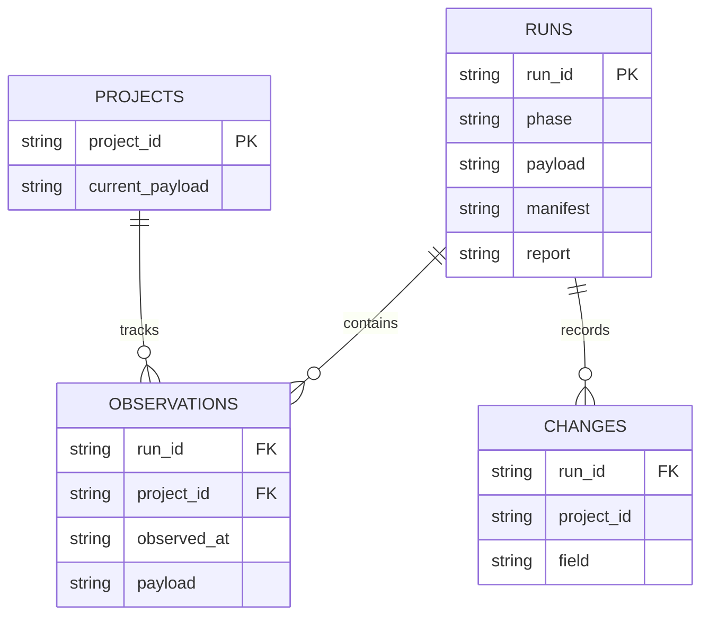

# 架构与关键取舍

## 职责分离

`SKILL.md` 定义资料发现、原文审阅和机会分析的流程。`github_readonly.py` 采集公开 GitHub 数据，`evidence.py` 将本地原始摘录转换成证据记录，`radar.py` 执行结构校验、状态判定、数据库事务和文件导出。运行时只依赖 Python 标准库。

Agent 可以解释资料，但不能替代持久化和发布校验；Python 可以验证字段、哈希和时间，但不能判断自然语言陈述是否真实。

## 数据模型

证据单独存于 `evidence` 表，通过 JSON 内的 ID 引用；固定合同哈希存于 `meta`，明确的用户反馈存于 `feedback`。GitHub 项目使用数值仓库 ID，名称变化不会生成新身份。数据库没有把所有嵌套字段拆成关系表，便于保留完整的可审计快照。

## 发布与恢复

1. 先检查输入结构与类型；首次发布固定一个判定时刻，验证引用、时效和机会状态，将结果保存为决策快照。
2. 在同一个 SQLite 事务中保存证据、项目、观测、变化和最终报告文本。
3. 提交数据库后，以临时文件加 `os.replace` 写出 `daily.md`、`data.json`、`audit.json`。正文与计数使用同一快照，两个 JSON 导出共享 `evaluation`。
4. 文件导出中断时，`export` 从已提交的数据库记录恢复产物。

同一个 run 的相同草稿内容重复发布不重新判定时效、不重复插入观测；修改已发布 run 的内容会被拒绝。旧观测不能回滚较新的当前快照。本次没有观察到某个 issue，也不会直接将历史 issue 标记为已关闭。

SQLite 和文件系统没有跨资源事务，因此数据库是事实来源，报告是可再生成的投影。项目定位为本地串行工作流，尚未做多进程高并发吞吐测试。

## 机会分级

| 状态 | 典型触发条件 |
| --- | --- |
| `candidate_for_review` | 当前证据完整、任务清楚、未发现占用，仍需用户复核 |
| `needs_verification` | 证据过期、检查不足、许可或状态未知 |
| `in_progress` | 发现受理人、评论认领或进行中的 PR |
| `excluded` | 仓库归档、issue 关闭或关联 PR 已合并等 |

历史记录保留上次观测状态。做出当前的关闭、认领、PR 等判定前，先检查相应状态与来源时效；过期证据降为待核验。新鲜的仓库归档或 issue 关闭证据可独立排除，无需等待不相关检查完成。

动态证据的代码校验窗口为 24 小时；检查对象包含 issue、评论、时间线与 PR。1.1.0 已执行配置中的动态 TTL、上下文上限和运行级请求预算，并冻结运行配置；其他编辑策略仍由 Agent 执行。优先级采用兴趣、差异、关联和健康度的启发式加权，不是训练出的推荐模型。

## 网络与数据边界

GitHub 采集只发 HTTPS GET，限制域名、响应大小、请求预算和分页数；遇到限流会停止本次继续请求。未完成的分页、未知字段和网络失败保留为可见状态。网络工具的原始输入仍是不可信数据，不能改变本地任务授权。

公开版本使用空画像。个人画像、状态库和日报应放在独立运行目录；证据哈希提供完整性检查，不提供来源真实性认证。自动重试调度、多平台独立采集器、向量检索和自动代码贡献均未实现。

## 1.1.0 的工作流边界

`workflow.py` 编排采集、初稿与语义审阅，`workflow_store.py` 保存请求和捕获台账，`provenance.py` 回读验证主体、内容和机器字段，`runtime_policy.py` 解析并冻结硬约束。数据库以增量表扩展，不重写既有运行；旧工作区 setup 会先生成数据库备份。

请求额度在网络调用前原子预留，未知的中断请求仍消耗预算。采集器只提供字段与证据，未自动判断自然语言认领或个人能力。prepare 不覆盖草稿，review 不允许修改机器字段，publish 再次回读来源。缓存、自动退避调度、在线服务和排序学习仍未实现。
